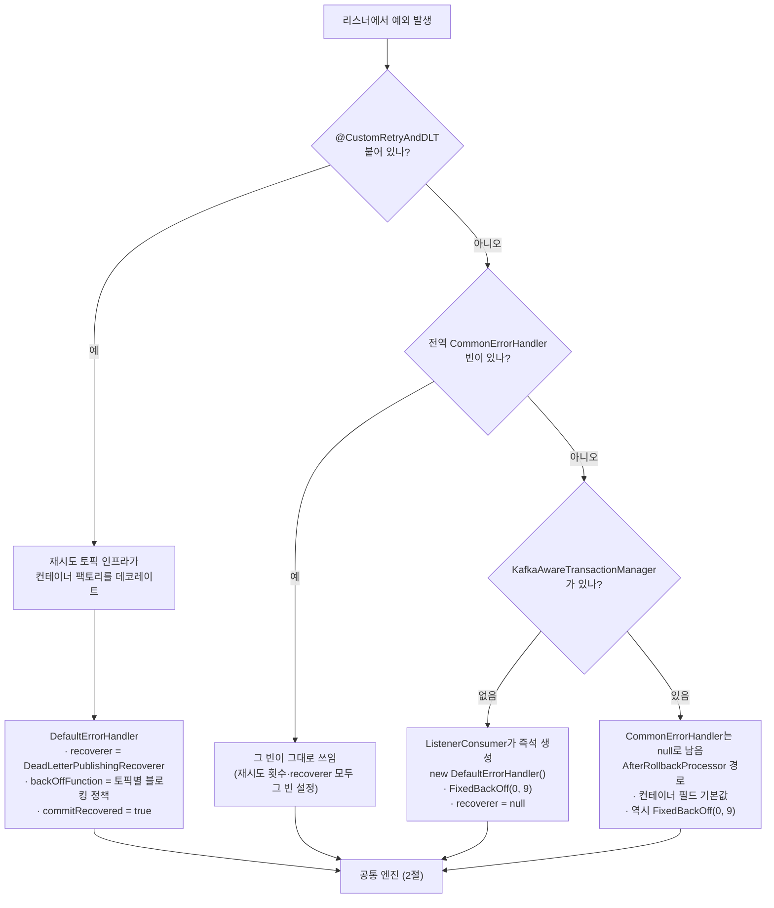
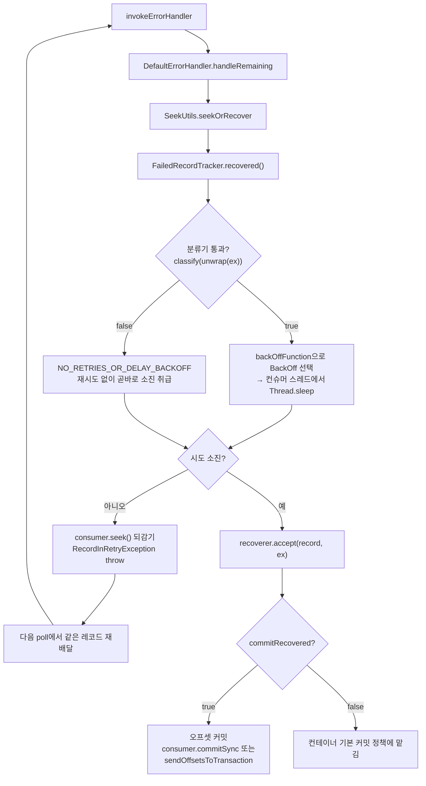
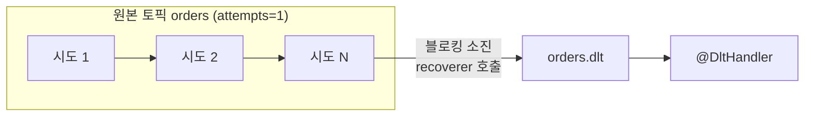
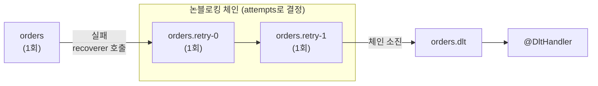
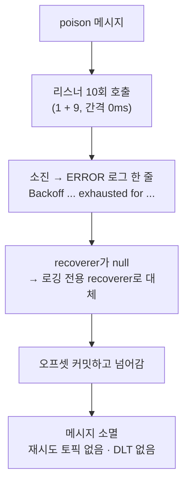
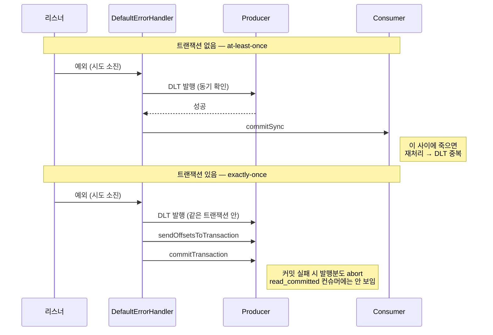

# 재시도와 DLT 처리 흐름

`@CustomRetryAndDLT`(`kafka-retry-dlt` 모듈)를 붙였을 때와 붙이지 않았을 때, 리스너에서 예외가 났을 때 실제로 무엇이 도는지 정리한다.

이 문서의 내용은 전부 Spring Kafka 3.3.11 바이트코드 확인 + EmbeddedKafka 실측으로 검증했다. 근거가 되는 테스트는 마지막 절에 매핑해 두었다.

---

## 1. 누가 실패를 처리하는가

가장 먼저 갈리는 지점. "에러 핸들러가 없는 상태"는 존재하지 않는다 — 빈으로 등록하지 않아도 프레임워크가 하나 만들어 쓴다.



핵심 분기 코드는 `KafkaMessageListenerContainer$ListenerConsumer.determineCommonErrorHandler()`:

```java
var configured = container.getCommonErrorHandler();
if (configured == null && transactionManager == null) {
    configured = new DefaultErrorHandler();   // 즉석 생성, 스프링 빈 아님
}
return configured;
```

**주의할 점 두 가지**

- 즉석 생성된 인스턴스는 스프링 빈이 아니다. 컨텍스트에서 조회할 수 없고 컨테이너마다 별개 인스턴스다.
- 트랜잭션 매니저가 있으면 이 즉석 생성이 **아예 일어나지 않는다**. `AfterRollbackProcessor`는 즉석 생성이 아니라 `AbstractMessageListenerContainer` 생성자가 필드 기본값으로 이미 심어 둔 것이라는 점이 다르다.

---

## 2. 공통 엔진 — 블로킹 재시도와 recover

어떤 경로로 들어왔든 `DefaultErrorHandler`(또는 `DefaultAfterRollbackProcessor`)는 같은 구조를 돈다. 둘 다 `FailedRecordProcessor`를 상속한다.

여기서 중요한 것은 **반복문이 없다는 점**이다. 한 번 자고, 되감고, 예외를 던진다. 재시도는 다음 poll 사이클에서 일어난다.



이 구조에서 따라오는 결과들:

| 관찰 | 이유 |
|---|---|
| 블로킹 재시도 1회 = poll 사이클 1회 | 되감고 예외를 던져 나가므로 다음 poll에서 재배달된다 |
| 트랜잭션에서 시도마다 새 트랜잭션이 열린다 | poll 사이클이 새로 도니 트랜잭션 경계도 새로 잡힌다 |
| `max.poll.interval.ms`와 비교할 값은 **개별 백오프 하나** | sleep이 poll과 poll 사이에 들어간다. 전체 블로킹 구간이 아니다 |
| `backOffFunction`이 `null`을 돌려주면 위험 | 기본값 `FixedBackOff(0, 9)`로 떨어져 "블로킹 없음"이 아니라 "간격 없이 10회" 가 된다 |

---

## 3. `@CustomRetryAndDLT` 를 붙였을 때

`recoverer`가 `DeadLetterPublishingRecoverer`이고, 목적지는 `DestinationTopicResolver`가 정한다. 그래서 **"recover"가 곧 DLT는 아니다** — 다음 홉일 수도 있다.

**둘 중 하나만 고르는 것이 설계다.** `attempts`와 `blockingAttempts`를 둘 다 1보다 크게 두면 안 된다 — 뒤에서 보듯 시도 횟수가 곱해진다. 그래서 경로도 하나가 아니라 둘이다.

### 3-1. 블로킹 전용 (`attempts=1`)

재시도 토픽을 만들지 않는다. 실패하면 원본 토픽 안에서 로컬로 반복한다.



### 3-2. 논블로킹 전용 (`blockingAttempts=1`, 기본값)

로컬 반복 없이 매 시도가 다음 재시도 토픽으로 넘어간다.



| 구성 | `attempts` | `blockingAttempts` | 경로 |
|---|---|---|---|
| 블로킹 전용 | `1` | `N` | 원본 N회 → DLT |
| 논블로킹 전용 | `N` | `1` (기본) | 원본 → retry 토픽들 → DLT |
| DLT 없음 | — | — | `dltStrategy = NO_DLT` → 소진 후 폐기 |

> 두 값 모두 "총 시도 횟수"다. `2`면 최초 1회 + 재시도 1회다. Spring Kafka의 `attempts` 의미를 그대로 따랐다.

### 두 축을 동시에 켜면 (금지된 조합, 실측)

`attempts`와 `blockingAttempts`를 동시에 1보다 크게 두면 **홉마다 블로킹이 다시 걸린다.** 재시도 토픽도 결국 하나의 토픽이고, 거기서 실패해도 같은 `backOffFunction`이 다시 적용되기 때문이다.

`@CustomRetryAndDLT`는 이 조합을 기동 시점에 막는다. 그 가드가 왜 필요한지 근거를 남기려고, 가드가 없는 Spring 순정 `@RetryableTopic` + 전역 블로킹 설정으로 같은 조합을 직접 구성해 재현했다(`RetryAttemptsMultiplyTest`). `attempts=3` + 전역 블로킹 3회:

```
multiply-orders          × 3
multiply-orders-retry-100 × 3
multiply-orders-retry-200 × 3
multiply-orders-dlt       × 1
```

**비즈니스 로직이 9회(3 × 3) 실행됐다.** 홉 수와 블로킹 횟수의 곱이다. `@CustomRetryAndDLT`를 쓰면 이 상태 자체에 도달할 수 없다:

```
Listener#handle: attempts=3, blockingAttempts=3 를 함께 쓰면
총 시도 횟수가 9회가 된다.
블로킹 전용이면 attempts=1, 논블로킹 전용이면 blockingAttempts=1로 둬라.
```

---

## 4. 애노테이션이 없을 때 (실측)

가장 조용히 위험한 경로. 실측값이다.



트랜잭션 유무와 **무관하게 동일하다**. 실측 결과:

| 구성 | 리스너 호출 | 소진 로그 | 생성된 토픽 |
|---|---|---|---|
| 애노테이션 없음, TX 없음 | 정확히 10회 | `FixedBackOff{interval=0, currentAttempts=10, maxAttempts=9} exhausted` | 원본뿐 |
| 애노테이션 없음, TX 있음 | 정확히 10회 | 동일 (+ `Transaction rolled back` 10회) | 원본뿐 |

두 경로가 서로 다른 클래스(`DefaultErrorHandler` / `DefaultAfterRollbackProcessor`)를 타는데도 결과가 같은 이유는, 둘 다 같은 상수 `SeekUtils.DEFAULT_BACK_OFF = FixedBackOff(0, 9)`를 쓰기 때문이다.

**즉, 아무 설정도 하지 않은 리스너는 실패 메시지를 예외도 DLT도 없이 잃는다.** 유일한 흔적은 ERROR 로그 한 줄이다.

---

## 5. DLT 발행의 원자성

발행과 오프셋 커밋이 한 트랜잭션에 묶이는지가 갈린다.



| 상태 | 조건 | 결과 |
|---|---|---|
| `AT_LEAST_ONCE` | 트랜잭션 없음 | 유실 없음, **중복 가능** |
| `EXACTLY_ONCE` | 트랜잭션 프로듀서 + `read_committed` | 중복 없음 |
| `BROKEN_EXACTLY_ONCE` | 트랜잭션은 켰지만 `isolation-level` 미설정 | 발행은 원자적인데 소비 측이 abort된 레코드를 읽어 **EOS가 성립하지 않음** |

세 번째가 가장 위험하다. 설정이 반만 되어 EOS처럼 보이지만 중복이 그대로 샌다. `DltTransactionInspector`가 기동 시 WARN으로 잡는다.

EOS를 켜려면 애플리케이션 설정 두 줄이면 된다. 모듈 코드 변경은 필요 없다.

```yaml
spring.kafka.producer.transaction-id-prefix: my-app-tx-
spring.kafka.consumer.isolation-level: read-committed
```

**발행 자체가 실패하면** 유실이 아니라 정체다. `DeadLetterPublishingRecovererFactory`가 `setFailIfSendResultIsError(true)`로 만들고 `verifySendResult`가 전송 결과를 블로킹으로 확인하므로, 실패는 예외가 되어 오프셋이 커밋되지 않는다. DLT 브로커가 죽어 있는 동안 그 파티션은 같은 레코드를 무한 재처리한다. 증상이 컨슈머 랙으로만 드러나므로 랙 알람이 필요하다.

---

## 6. 검증 근거

| 문서의 주장 | 검증 테스트 |
|---|---|
| 메타 애노테이션이 `@RetryableTopic`으로 인식된다 | `CustomRetryAndDLTTest` |
| 재시도 체인이 실제로 돈다 | `CustomRetryAndDLTChainTest` |
| 블로킹/논블로킹 × DLT 유무 4분면 | `RetryModeMatrixTest` |
| 두 축을 동시에 켜면 시도 횟수가 곱해진다 (금지된 조합) | `RetryAttemptsMultiplyTest` |
| 블로킹 BackOff 선택 규칙, null 미반환 | `CustomRetryDltPolicyTest` |
| 발행 후 커밋 실패 → 중복 (at-least-once) | `DltPublishThenCommitFailTest` |
| 발행 실패 → 유실 없이 정체 | `DltPublishFailTest` |
| 트랜잭션으로 중복 제거 (EOS) | `DltPublishEosTest` |
| 블로킹 조합에서의 원자성 | `BlockingRetryDltAtomicityTest` |
| 개별 백오프 vs `max.poll.interval.ms` | `BlockingRetryPollIntervalTest` |
| 토픽 이름 규칙 | `RetryTopicNamingTest` |
| 토픽 부재/잔존 시 동작, 기동 검사 | `RetryTopicPresenceTest` |
| **애노테이션 없을 때의 기본 동작** | `NoAnnotationDefaultBehaviorTest`, `NoAnnotationTxDefaultBehaviorTest` |

---

## 7. 알아 두면 좋은 함정

- **재시도 토픽 이름은 규칙이 단순하지 않다.** `-retry`가 될지 `.retry-0`이 될지는 재시도 횟수가 아니라 `sameIntervalTopicReuseStrategy`가 정한다. 간격이 모두 같으면 `attempts=4`여도 토픽 하나로 합쳐지면서 인덱스가 사라진다.
- **논블로킹에서 블로킹으로 설정을 바꾸면 기존 재시도 토픽의 메시지가 방치된다.** 구독하는 리스너가 사라지고 토픽은 지워지지 않는다. 전환 전에 비워야 한다.
- **`autoCreateTopics=false`(기본값)에서 토픽이 없으면 기동이 실패한다.** 의도된 동작이다. 그대로 뜨면 첫 장애 메시지에서 파티션이 조용히 멈춘다.
- **블로킹 횟수가 10을 넘으면 `Backoff ... exhausted` 로그가 뜬다.** 컨테이너 기본 롤백 처리기가 자기 카운터를 따로 세기 때문이다. 레코드가 버려진 것처럼 보이지만 실제로는 설정한 횟수를 끝까지 채운다.
- **리스너와 DLT 핸들러는 멱등해야 한다.** at-least-once 구성에서는 중복이, 롤백 후 재처리에서는 블로킹 한 벌이 통째로 반복된다.
